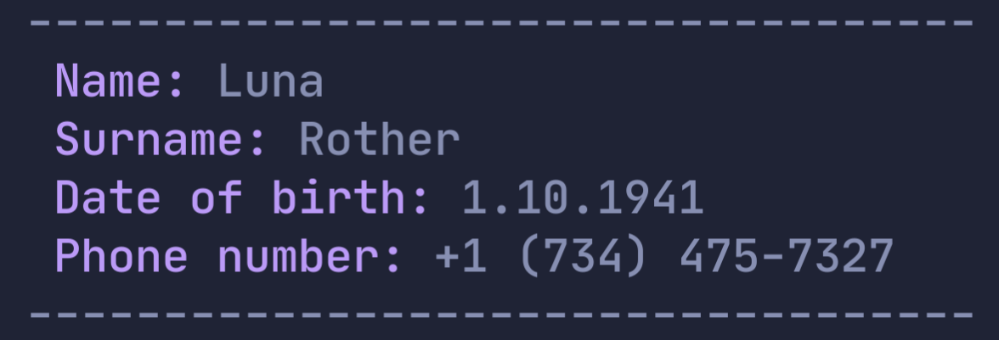

# Name generator written in Python
This is a simple name generator. This program is a solution to the first coding challenge from the set of programming challenges that I'm currently working on.

## Usage
Simply clone the project, `cd` into the cloned directory and type something like this:
```bash
python3 generator.py
```
No additional arguments required.

## Features
This script can generate name, surname, date of birth and phone number of a fake person. It has multiple thousands of american names and surnames to choose from. The result of the execution looks like this:
